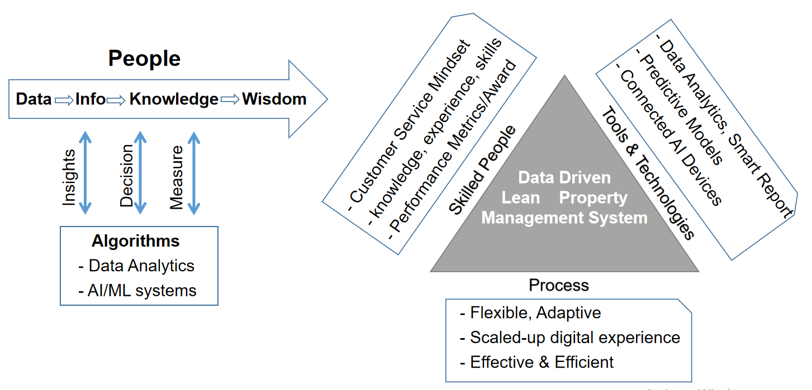

---
output:
  html_document: 
    toc: true
    toc_float: true
---

<!-- try to put image after navbar -->

<link rel="stylesheet" href="styles.css" type="text/css">

##**Our Goals & Objectives**

***

- To maintain the property in superb condition,
- To keep expenses within the operating budget,
- To explore opportunities for revenue growth or expense reduction,
- To assess and address capital needs proactively,
- To comply with all Federal, State, and local laws and regulations, and
- To provide excellent service to all residents.

 
Property management service is important to both landlords and tenants. Our philosophy is pretty simple: to do a good job, i.e. to find quickly lease customers for landlords and make tenants happy once they move in. DeepCare's mission is to improve the lives of real estate investors and residents through property management. It might not be on signs or posted around the office, but it’s something We talk about every day.To understand customer needs and wants is our top priority.

##**Services**
***
- Full property management services, including:
- Advertising real estate for rent or lease
- Procuring prospective tenants, screening & qualifications
- Charging and collecting rent or lease payments
- Inspection, maintenance and repair
- Vendor development
- Trust fund management, accounting and reporting
- Assist on rental property related tax reporting 
- Rental property management record keeping
- Assist on legal procedures
- ...

 

##**Effectiveness & Efficiency**
***
We combine lean, agile and digital technology together, focusing on service effectivenss and efficiency for landlord. with the effectivenss and efficiency in place, and bring you peaceful mind, adding no troubles during your property lease, because we are:

- Full service provider
- Comprehensive customer care experiences
- Data based machine learning property marketing intelligence
- In-House maintenance & repair capabilities & experiences
- Team combination with various required skills, licensed professionals
- Carefulness, Seriousness, order, system approach, responsibility
- Preventative maintenance experiences and tools

 
The traditional marketing methods for real property management are facing challenges, on cost and effectiveness. Nowadays, everybody including landlord and tenant is empowered and digitally-savvy, and now that the digital transformation has firmly taken hold, they know how to filter out the noise of online advertisements and find the data they need to make informed decisions.

customers and customer needs vary a great deal. Only through proper customer segmentation can their needs be better understood. But the challenge is the numerous details, and ever changing situations, hard to imagine. The Digital technologies provide new tools and channels of real property marketing and out-reach, easy, effective and with great user experience. There are many digial based marketing channels, such as, websites, SEO, content marketing, PPC, email marketing, viedo marketing and social media marketing. DeepCare has people and experience in using digital markeing tools and channels.

 

 

##**Sample Q & A**
***

- **Question** :One of our tenants recently requested that we paint the inside of her apartment. She has threatened to do it herself and deduct the cost of the paint from the rent if we do not  have it painted within the next two weeks. Is she legally able to carry out her threat?
- **Answer** :Unless the condition of the walls rendered the premises uninhabitable, the owner is under no obligation to paint the unit at the request of the tenant.

- **Question**:What is the most useful information on the tenant’s application for collection purposes?
- **Answer** :The most useful for locating former residents are the Social Security, driver’s license and license plate numbers. For collection on judgments, current employment and bank account records are the most valuable.

- **Question**: What is an estoppel certificate? The owner of the property I manage requested that each of the tenants sign an estoppel certificate. I did not want to appear unknowledgeable.
- **Answer** : An estoppel certificate is a document signed by the tenant certifying that the major terms of the lease are true and correct. Estoppel certificates are sometimes required during the sale of rental property so the buyer knows that the tenant understands and agrees to the major terms of the lease.

- **Question**: Can we legally restrict the number of automobiles our tenants can park on the property? There is open parking but some of our tenants have four or five cars.
- **Answer** : You have the right to control the number of automobiles that the tenant may park on the property.  Clear guidelines should be given in writing and equally enforced.

- **Question**: A tenant’s child broke a glass shower door. Can I charge the tenant for the repair of the door?
- **Answer** : The tenant is liable for any damage done by its invitees, guests or other occupants of the premises. The tenant should have to pay for the repair of the door.

- **Question**: New tenants signed our lease and paid the first month’s rent. Now they want to get out of the lease. They did not take possession.
- **Answer** : When the tenant signs a lease, they are bound by the terms whether or not they change their mind later.
