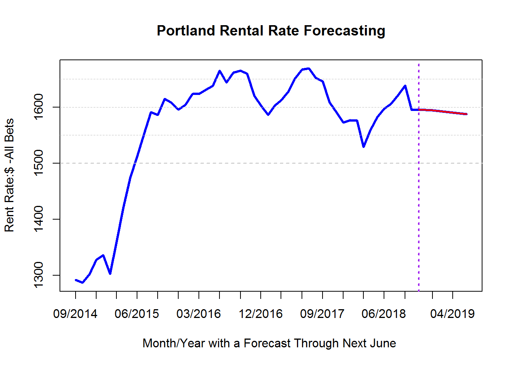

---
output:
  html_document: 
    toc: true
    toc_float: true
---

<!-- try to put image after navbar -->

<link rel="stylesheet" href="styles.css" type="text/css">

##**Deep Learning to Deep Care**
***

Deep-learning uses various deep neural networks that are capable of automatically learning from data, making predictions based on data and automating the task without being explicitly programmed to do so. With great success, deep-learning has been applied in many fieds, such as health care, insurance, NPL, image processing, insurance, autonomous vehicles. Under the spirit of ever-improving deep-learning networks as well as a powerful digital tool, Deep-learning to Deep Care has been a unique positioning of Deep Care Property Management LLC, characterized by the deep insights of customer needs/wants, digital-based flawless execution, such as digital marketing, predictive maintenance, smart accounting reports and smart customer interactions.

As an example, above graph shows the next 6 month rental rate forecast, based on machine learning model and data available. some of the comments below:

- We build deep-learning model from historical data as well as other data such as the trends of future economic factors and indicators, and able to forecast confidently the rental rate changes in the next six months.

-  As we can see, in at least next 6 months, the rental rates are going to decline a little bit, which is a good news to tenants, but not so good for landlord. More must be done to save costs and improve property management efficiency.

-  Among many others, one of the answers to the challenge of real property management is the embrace the digital technologies, digital marketing and combination of digital technolgies with the maturity and lean and agile systems.

##**Lean, Agile, Digital Process**
***

Deep Care Property Management combines LEAN, AGILE DIGITAL three in one, leveraging their advantages and successful stories, the maturity and effectiveness of lean manufacturing system, flexible and adaptive agile project management methodology and the efficient and great user-experience of digital tools, all focusing at three things: people, process, tools & technolgies.
 

##**Reliable Professionals**

***

We are a group of people with comprehensive knowledge, experience and skills related to property management, including many year's work experience in Honeywell Building Solutions, Connected Home and Energy Management, Data Analytics and Deep Learning for Facility Management.

<!-- Jack Wu -->

**JACK WU**

- Oregon Certified property manager
- 9 Year Honeywell Building Solution work experience
- Managed many residential and commercial buildings
- Data analytics and deep learning expertise

<!-- don johnson -->

 

 

**DON JOHNSON**
 

- LEED certified project manager
- 21 year property development & management experience
- A member of the American Institute of Certified Planners
- Master of Planning, Humphrey Institute of Public Affairs, Univ of Minnesota

<!-- curt sommer-->

 

 

**CURT SOMMER**
 

- 5+ year home buiding/renovation hands on experience
- Hands-on skills with home maintenance, repair, renovation and rebuild
- Broad connection with various service suppliers and experience in suppliers
- Mechanical and electrical engineering background

